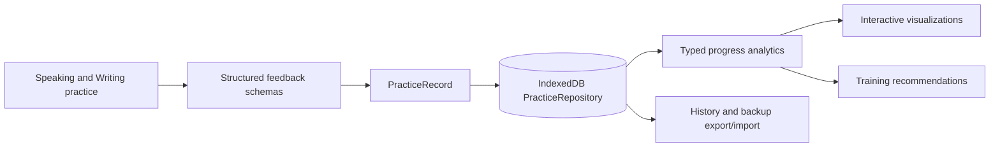
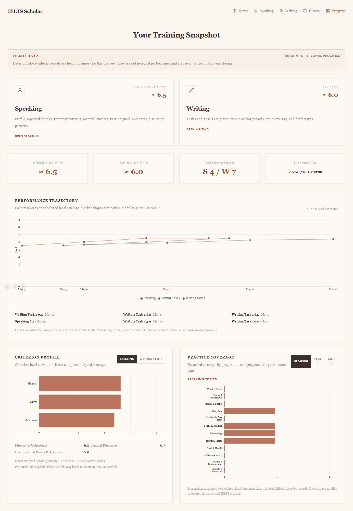
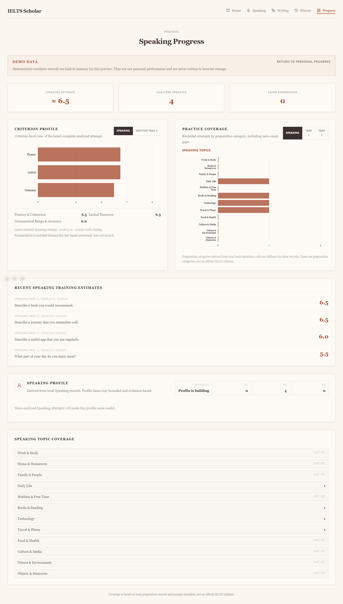
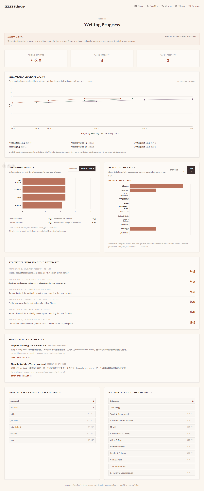

# IELTS Scholar

IELTS Scholar is a local-first IELTS Speaking and Writing training application for structured practice, AI-assisted feedback, persistent learning records, and learning analytics. It is designed as a genuine learning tool: estimates are conservative training signals, provenance is visible, and the product does not present AI feedback as an official IELTS result.

## What is implemented

- Speaking practice for Parts 1, 2, and 3, including topic-thread and discussion feedback flows.
- Writing Task 1 Academic and Writing Task 2 practice with structured criterion feedback.
- IndexedDB-backed practice history, active-state recovery, backup export/import, and legacy local-storage migration safeguards.
- Structured TypeScript feedback schemas and local Markdown export.
- Provider routing for the default mock provider and optional Gemini or auto/DeepSeek local-development modes.
- Progress profiles, data-derived training recommendations, and interactive learning analytics.
- Browser verification with Playwright plus focused TypeScript replay/fixture checks.

## Technical stack

- React 19, TypeScript, Vite, and React Router
- Tailwind CSS with the project's paper-based visual system
- Recharts for responsive, interactive SVG data visualizations
- IndexedDB through the local `PracticeRepository`, with guarded legacy localStorage compatibility
- Typed AI feedback contracts, normalization, provider diagnostics, and local export helpers
- Playwright for route, persistence, interaction, and visualization verification

The provider configuration is intentionally local-development oriented. Mock is the default. Browser-exposed API keys are not a production deployment model; do not commit `.env.local` or credentials.

## Learning analytics and data visualization

The Progress interface transforms structured local practice records into three analytical representations:

1. **Performance trajectory** — chronological observed band estimates for Speaking, Writing Task 1, and Writing Task 2, with module-specific markers and provenance tooltips.
2. **Criterion profile** — the latest complete Speaking or Writing Task 2 criterion scores on a consistent 0–9 scale. Pronunciation is explicitly excluded from text-based Speaking assessment.
3. **Practice coverage** — switchable horizontal category charts for Speaking topics, Task 1 visual types, and Task 2 topics, including zero-count gaps.

The transformations live in `src/lib/progressAnalytics.ts`; Recharts rendering lives in `src/components/progress/`. Normal charts use IndexedDB-backed structured practice history rather than hard-coded production values. Sparse or missing evidence produces an honest insufficient-data state.



## Run locally

Requirements: a current Node.js/npm installation and Chromium support for browser verification.

```bash
npm ci
npm run dev
```

Open `http://localhost:3000`. The default mock provider works without an API key.

For optional local provider testing, use an uncommitted `.env.local` with `VITE_AI_PROVIDER=gemini` or `VITE_AI_PROVIDER=auto` and the corresponding `VITE_GEMINI_API_KEY` / `VITE_DEEPSEEK_API_KEY`. See `src/lib/ai/router.ts` for the current routing contract.

## Synthetic visualization demo

Open:

```text
http://localhost:3000/progress?demo=1
```

The `demo=1` query uses a small deterministic in-memory fixture. It does not read personal Progress records, write synthetic records to IndexedDB/localStorage, or mix demo records with personal history. The interface displays a clear **Demo data** label.

### Demo screenshots

All screenshots below are generated by Playwright from synthetic demo records only.



<details>
<summary>Speaking criterion and coverage view</summary>



</details>

<details>
<summary>Writing trajectory, criterion and coverage view</summary>



</details>

## Verification

```bash
npm run lint
npm run build
npm run verify:progress-visualizations
npm run verify:progress-ui
npm run verify:history-restore-ui
```

`verify:progress-visualizations` checks chronological transformations, score-series separation, latest criterion selection, pronunciation exclusion, zero-count coverage, and empty analytics. `verify:progress-ui` checks normal Progress routes, demo rendering, all three chart surfaces, synthetic-data non-persistence, and regenerates the demo screenshots.

Additional feedback-quality and replay commands are listed in `package.json` and mapped in `docs/CODEBASE_MAP.md`.

## Repository orientation

- `docs/CURRENT_STATE.md` — current validated product baseline
- `docs/CODEBASE_MAP.md` — runtime and file navigation
- `docs/PRODUCT_DESIGN_PRINCIPLES.md` — durable product and feedback principles
- `docs/PROJECT_BACKLOG.md` and `docs/ROADMAP.md` — future work
- `AGENTS.md` — repository working agreements

## Development approach

The project uses an AI-assisted software development workflow. The project owner directs product requirements, interaction design, data logic, iterative evaluation, and repository decisions; AI coding tools are used as implementation and verification assistants.

## Current boundaries

- Pronunciation is not formally scored.
- Audio transcription remains browser/provider dependent.
- Provider keys and routing are suitable for local personal development, not a multi-user production service.
- There is no server-side auth, cloud database, or SaaS key-management layer.
- Training estimates and preparation categories are not official IELTS results or an official IELTS syllabus.
